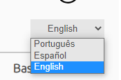
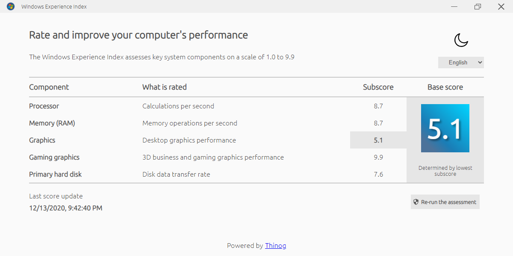
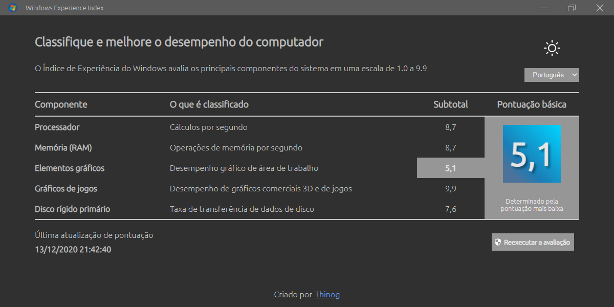

# Universal Experience Index
<center>
<a href='//www.microsoft.com/store/apps/9P48RQ7GLRF1?cid=storebadge&ocid=badge'></a></center>
Electron application made to replace the Windows Experience Index, which existed until Windows 7 and was removed from later versions of the operating system.

---

## Comandos locais

### Executar localmente
```bash
npm start
```

### Gerar pacote localmente
```bash
npm run dist
```

### Publicar pacote
```bash
npm run publish
```

---

## Informações adicionais
### Modo claro e escuro
A aplicação possui dois temas, claro e escuro, sendo possível trocar pelo ícone de sol ou lua no canto direito superior.


### Multi-idioma 
É possível trocar o idioma da aplicação para português, inglês e espanhol, selecionando no seletor de idioma.



### Screenshots

Modo claro em inglês




Modo escuro em português

